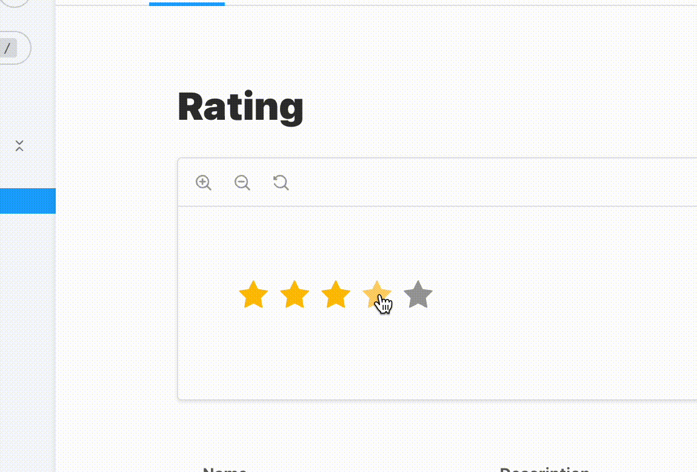

[](https://badge.fury.io/js/react-animation-rating)

# React-animation-rating
A simple component to display rating as stars

## Installing as a package

```
npm i react-animation-rating
```

## Usage

```js
import React, {useState} from 'react';
import RatingAnimation from "react-animation-rating";
import 'react-animation-rating/dist/style.css';

function App() {
  const [value, setValue] = useState(4);
  return (
    <div className="App">
      <div className="App-header">
        <RatingAnimation value={value} onChange={setValue}/>
      </div>
    </div>
  );
}

export default App;
```
## Demo
[https://u4aew.github.io/react-animation-rating/](https://u4aew.github.io/react-animation-rating/)



## Options
| Name              | Type     | Required | Default |
|-------------------|----------|----------|---------|
| sizeStar          | number   | false    | 24      |
| countItem         | number   | false    | 5       |
| value             | number   | true     |         |
| colorStar         | string   | false    | #ffc107 |
| colorInactiveStar | string   | false    | #9e9e9e |
| disabled          | boolean  | false    | false   |
| className         | string   | false    |         |
| onChange          | function | false    |         |
